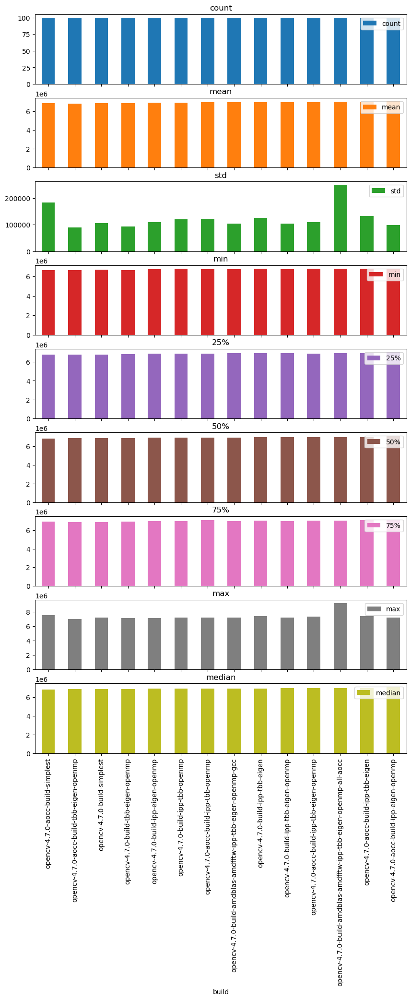
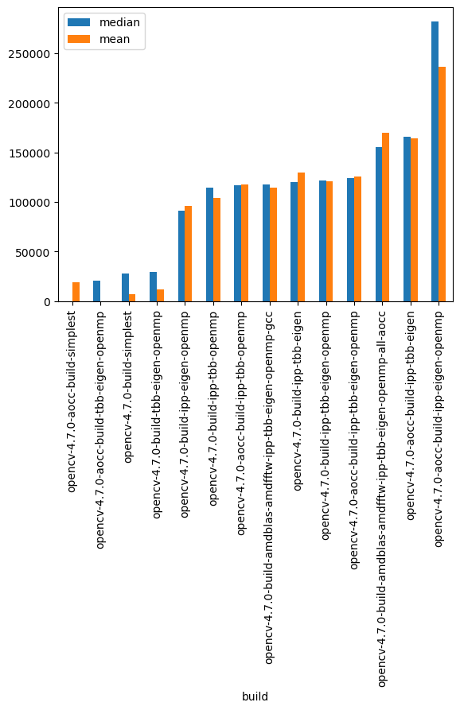
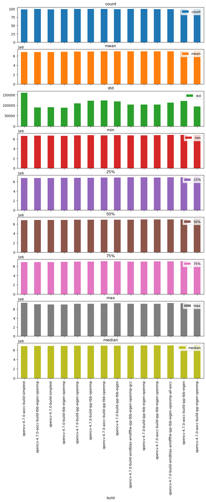
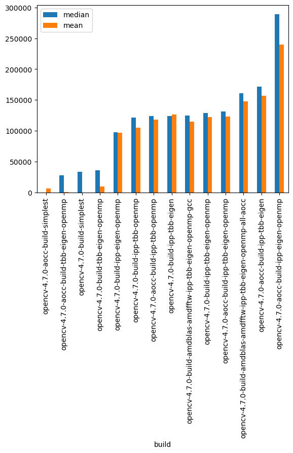

# OpenCV Benchmarking analysis

## Usage
1. Make a directory where the OpenCV builds are stored.
2. Run ```sudo python3 benchmark.py [# of executions]```
   
   For example, to run the test program 200 times for each build, do:
   
    ```sudo python3 benchmark.py 200```

The benchmark results are saved in a CSV file after all the executions have finished.

## Analysis

### Create dataset from combined benchmarks


```python
from os import listdir
from os.path import isfile, join

benchmark_result_dir = './benchmark-results/'
csv_files = [benchmark_result_dir + f for f in listdir(benchmark_result_dir) if isfile(join(benchmark_result_dir, f))]
```


```python
import pandas as pd

df_list = [ pd.read_csv(f) for f in csv_files ]
df = pd.concat(df_list)
```


```python
df.columns = ['build', 'time']

df
```


<div>
<style scoped>
    .dataframe tbody tr th:only-of-type {
        vertical-align: middle;
    }

    .dataframe tbody tr th {
        vertical-align: top;
    }

    .dataframe thead th {
        text-align: right;
    }
</style>
<table border="1" class="dataframe">
  <thead>
    <tr style="text-align: right;">
      <th></th>
      <th>build</th>
      <th>time</th>
    </tr>
  </thead>
  <tbody>
    <tr>
      <th>0</th>
      <td>opencv-4.7.0-build-amdblas-amdfftw-ipp-tbb-eig...</td>
      <td>7325556</td>
    </tr>
    <tr>
      <th>1</th>
      <td>opencv-4.7.0-build-amdblas-amdfftw-ipp-tbb-eig...</td>
      <td>6889897</td>
    </tr>
    <tr>
      <th>2</th>
      <td>opencv-4.7.0-build-amdblas-amdfftw-ipp-tbb-eig...</td>
      <td>7152223</td>
    </tr>
    <tr>
      <th>3</th>
      <td>opencv-4.7.0-build-amdblas-amdfftw-ipp-tbb-eig...</td>
      <td>7113928</td>
    </tr>
    <tr>
      <th>4</th>
      <td>opencv-4.7.0-build-amdblas-amdfftw-ipp-tbb-eig...</td>
      <td>6844989</td>
    </tr>
    <tr>
      <th>...</th>
      <td>...</td>
      <td>...</td>
    </tr>
    <tr>
      <th>1395</th>
      <td>opencv-4.7.0-aocc-build-ipp-eigen-openmp</td>
      <td>7122210</td>
    </tr>
    <tr>
      <th>1396</th>
      <td>opencv-4.7.0-aocc-build-ipp-eigen-openmp</td>
      <td>7006331</td>
    </tr>
    <tr>
      <th>1397</th>
      <td>opencv-4.7.0-aocc-build-ipp-eigen-openmp</td>
      <td>7000310</td>
    </tr>
    <tr>
      <th>1398</th>
      <td>opencv-4.7.0-aocc-build-ipp-eigen-openmp</td>
      <td>6974605</td>
    </tr>
    <tr>
      <th>1399</th>
      <td>opencv-4.7.0-aocc-build-ipp-eigen-openmp</td>
      <td>7152995</td>
    </tr>
  </tbody>
</table>
<p>1400 rows × 2 columns</p>
</div>


### Group by build and aggregate with mean average, median average, standard deviation, min/max and percentiles


```python
result = df.groupby('build', sort=False)['time'].aggregate(['describe', 'median'])
result.columns = result.columns.get_level_values(1)
result = result.rename(columns = {'time':'median'})
result = result.sort_values('median')

result
```


<div>
<style scoped>
    .dataframe tbody tr th:only-of-type {
        vertical-align: middle;
    }

    .dataframe tbody tr th {
        vertical-align: top;
    }

    .dataframe thead th {
        text-align: right;
    }
</style>
<table border="1" class="dataframe">
  <thead>
    <tr style="text-align: right;">
      <th></th>
      <th>count</th>
      <th>mean</th>
      <th>std</th>
      <th>min</th>
      <th>25%</th>
      <th>50%</th>
      <th>75%</th>
      <th>max</th>
      <th>median</th>
    </tr>
    <tr>
      <th>build</th>
      <th></th>
      <th></th>
      <th></th>
      <th></th>
      <th></th>
      <th></th>
      <th></th>
      <th></th>
      <th></th>
    </tr>
  </thead>
  <tbody>
    <tr>
      <th>opencv-4.7.0-aocc-build-simplest</th>
      <td>100.0</td>
      <td>6855419.63</td>
      <td>184745.104978</td>
      <td>6610901.0</td>
      <td>6752442.50</td>
      <td>6819535.5</td>
      <td>6899118.75</td>
      <td>7527438.0</td>
      <td>6819535.5</td>
    </tr>
    <tr>
      <th>opencv-4.7.0-aocc-build-tbb-eigen-openmp</th>
      <td>100.0</td>
      <td>6836018.69</td>
      <td>89118.348891</td>
      <td>6650593.0</td>
      <td>6775982.50</td>
      <td>6840096.5</td>
      <td>6886917.75</td>
      <td>7054231.0</td>
      <td>6840096.5</td>
    </tr>
    <tr>
      <th>opencv-4.7.0-build-simplest</th>
      <td>100.0</td>
      <td>6843038.85</td>
      <td>105631.285680</td>
      <td>6675846.0</td>
      <td>6774445.00</td>
      <td>6847463.0</td>
      <td>6897104.50</td>
      <td>7251981.0</td>
      <td>6847463.0</td>
    </tr>
    <tr>
      <th>opencv-4.7.0-build-tbb-eigen-openmp</th>
      <td>100.0</td>
      <td>6847719.29</td>
      <td>93052.655590</td>
      <td>6635080.0</td>
      <td>6792824.75</td>
      <td>6848682.0</td>
      <td>6911418.50</td>
      <td>7154453.0</td>
      <td>6848682.0</td>
    </tr>
    <tr>
      <th>opencv-4.7.0-build-ipp-eigen-openmp</th>
      <td>100.0</td>
      <td>6932026.68</td>
      <td>109286.100753</td>
      <td>6730034.0</td>
      <td>6835085.25</td>
      <td>6910445.0</td>
      <td>6997635.75</td>
      <td>7173161.0</td>
      <td>6910445.0</td>
    </tr>
    <tr>
      <th>opencv-4.7.0-build-ipp-tbb-openmp</th>
      <td>100.0</td>
      <td>6940102.69</td>
      <td>121419.426264</td>
      <td>6759975.0</td>
      <td>6833429.75</td>
      <td>6934303.5</td>
      <td>6985708.75</td>
      <td>7208841.0</td>
      <td>6934303.5</td>
    </tr>
    <tr>
      <th>opencv-4.7.0-aocc-build-ipp-tbb-openmp</th>
      <td>100.0</td>
      <td>6953425.35</td>
      <td>123044.787844</td>
      <td>6741076.0</td>
      <td>6860973.50</td>
      <td>6936310.0</td>
      <td>7057456.00</td>
      <td>7215185.0</td>
      <td>6936310.0</td>
    </tr>
    <tr>
      <th>opencv-4.7.0-build-amdblas-amdfftw-ipp-tbb-eigen-openmp-gcc</th>
      <td>100.0</td>
      <td>6950167.63</td>
      <td>103809.054839</td>
      <td>6733899.0</td>
      <td>6902013.00</td>
      <td>6936991.0</td>
      <td>6988557.50</td>
      <td>7206372.0</td>
      <td>6936991.0</td>
    </tr>
    <tr>
      <th>opencv-4.7.0-build-ipp-tbb-eigen</th>
      <td>100.0</td>
      <td>6965893.64</td>
      <td>126372.423317</td>
      <td>6763432.0</td>
      <td>6886191.00</td>
      <td>6939623.5</td>
      <td>7028654.50</td>
      <td>7419514.0</td>
      <td>6939623.5</td>
    </tr>
    <tr>
      <th>opencv-4.7.0-build-ipp-tbb-eigen-openmp</th>
      <td>100.0</td>
      <td>6957168.60</td>
      <td>103508.444795</td>
      <td>6744116.0</td>
      <td>6899612.00</td>
      <td>6941279.5</td>
      <td>6997028.75</td>
      <td>7192205.0</td>
      <td>6941279.5</td>
    </tr>
    <tr>
      <th>opencv-4.7.0-aocc-build-ipp-tbb-eigen-openmp</th>
      <td>100.0</td>
      <td>6961987.74</td>
      <td>109879.087952</td>
      <td>6770326.0</td>
      <td>6877297.50</td>
      <td>6943643.0</td>
      <td>7033112.50</td>
      <td>7345306.0</td>
      <td>6943643.0</td>
    </tr>
    <tr>
      <th>opencv-4.7.0-build-amdblas-amdfftw-ipp-tbb-eigen-openmp-all-aocc</th>
      <td>100.0</td>
      <td>7005582.95</td>
      <td>250163.747731</td>
      <td>6798125.0</td>
      <td>6907396.25</td>
      <td>6974466.5</td>
      <td>7020186.25</td>
      <td>9220909.0</td>
      <td>6974466.5</td>
    </tr>
    <tr>
      <th>opencv-4.7.0-aocc-build-ipp-tbb-eigen</th>
      <td>100.0</td>
      <td>7000149.49</td>
      <td>132918.945557</td>
      <td>6798781.0</td>
      <td>6908888.00</td>
      <td>6985467.5</td>
      <td>7080722.25</td>
      <td>7424478.0</td>
      <td>6985467.5</td>
    </tr>
    <tr>
      <th>opencv-4.7.0-aocc-build-ipp-eigen-openmp</th>
      <td>100.0</td>
      <td>7072209.42</td>
      <td>98525.622713</td>
      <td>6769947.0</td>
      <td>7009126.25</td>
      <td>7101698.5</td>
      <td>7147070.75</td>
      <td>7215781.0</td>
      <td>7101698.5</td>
    </tr>
  </tbody>
</table>
</div>


### Results


```python
#result = result.head(10)
```


```python
plt = result.plot.bar(subplots=True, figsize=(10,20))
```


    

    


I normalise the medians by subtracting the smallest one from all of them, to make it more obvious how big the difference is between them visually.


```python
min_median = result['median'].min()
min_mean = result['mean'].min()
normalised = pd.DataFrame(result['median'].apply(lambda m: m - min_median))
normalised['mean'] = pd.DataFrame(result['mean'].apply(lambda m: m - min_mean))
```


```python
plt = normalised.plot.bar()
```


    

    


## Clean up data with interquartile method


```python
def is_outlier(s):
    lower_limit = s.mean() - (s.std() * 3)
    upper_limit = s.mean() + (s.std() * 3)
    return ~s.between(lower_limit, upper_limit)
```


```python
df_cleaned = df[~df.groupby('build', sort=False, group_keys=False)['time'].apply(is_outlier)]
```


```python
result_cleaned = df_cleaned.groupby('build', sort=False)['time'].aggregate(['describe', 'median'])
result_cleaned.columns = result_cleaned.columns.get_level_values(1)
result_cleaned = result_cleaned.rename(columns = {'time':'median'})
result_cleaned = result_cleaned.sort_values('median')

result_cleaned
```


<div>
<style scoped>
    .dataframe tbody tr th:only-of-type {
        vertical-align: middle;
    }

    .dataframe tbody tr th {
        vertical-align: top;
    }

    .dataframe thead th {
        text-align: right;
    }
</style>
<table border="1" class="dataframe">
  <thead>
    <tr style="text-align: right;">
      <th></th>
      <th>count</th>
      <th>mean</th>
      <th>std</th>
      <th>min</th>
      <th>25%</th>
      <th>50%</th>
      <th>75%</th>
      <th>max</th>
      <th>median</th>
    </tr>
    <tr>
      <th>build</th>
      <th></th>
      <th></th>
      <th></th>
      <th></th>
      <th></th>
      <th></th>
      <th></th>
      <th></th>
      <th></th>
    </tr>
  </thead>
  <tbody>
    <tr>
      <th>opencv-4.7.0-aocc-build-simplest</th>
      <td>98.0</td>
      <td>6.841756e+06</td>
      <td>159384.460296</td>
      <td>6610901.0</td>
      <td>6751861.50</td>
      <td>6812571.0</td>
      <td>6892366.75</td>
      <td>7397416.0</td>
      <td>6812571.0</td>
    </tr>
    <tr>
      <th>opencv-4.7.0-aocc-build-tbb-eigen-openmp</th>
      <td>100.0</td>
      <td>6.836019e+06</td>
      <td>89118.348891</td>
      <td>6650593.0</td>
      <td>6775982.50</td>
      <td>6840096.5</td>
      <td>6886917.75</td>
      <td>7054231.0</td>
      <td>6840096.5</td>
    </tr>
    <tr>
      <th>opencv-4.7.0-build-simplest</th>
      <td>98.0</td>
      <td>6.835136e+06</td>
      <td>90681.542684</td>
      <td>6675846.0</td>
      <td>6772841.00</td>
      <td>6846003.0</td>
      <td>6896304.50</td>
      <td>7020496.0</td>
      <td>6846003.0</td>
    </tr>
    <tr>
      <th>opencv-4.7.0-build-tbb-eigen-openmp</th>
      <td>99.0</td>
      <td>6.844621e+06</td>
      <td>88189.553872</td>
      <td>6635080.0</td>
      <td>6792503.50</td>
      <td>6848654.0</td>
      <td>6905294.50</td>
      <td>7024677.0</td>
      <td>6848654.0</td>
    </tr>
    <tr>
      <th>opencv-4.7.0-build-ipp-eigen-openmp</th>
      <td>100.0</td>
      <td>6.932027e+06</td>
      <td>109286.100753</td>
      <td>6730034.0</td>
      <td>6835085.25</td>
      <td>6910445.0</td>
      <td>6997635.75</td>
      <td>7173161.0</td>
      <td>6910445.0</td>
    </tr>
    <tr>
      <th>opencv-4.7.0-build-ipp-tbb-openmp</th>
      <td>100.0</td>
      <td>6.940103e+06</td>
      <td>121419.426264</td>
      <td>6759975.0</td>
      <td>6833429.75</td>
      <td>6934303.5</td>
      <td>6985708.75</td>
      <td>7208841.0</td>
      <td>6934303.5</td>
    </tr>
    <tr>
      <th>opencv-4.7.0-aocc-build-ipp-tbb-openmp</th>
      <td>100.0</td>
      <td>6.953425e+06</td>
      <td>123044.787844</td>
      <td>6741076.0</td>
      <td>6860973.50</td>
      <td>6936310.0</td>
      <td>7057456.00</td>
      <td>7215185.0</td>
      <td>6936310.0</td>
    </tr>
    <tr>
      <th>opencv-4.7.0-build-ipp-tbb-eigen</th>
      <td>99.0</td>
      <td>6.961312e+06</td>
      <td>118372.424129</td>
      <td>6763432.0</td>
      <td>6885607.00</td>
      <td>6936367.0</td>
      <td>7020859.00</td>
      <td>7269909.0</td>
      <td>6936367.0</td>
    </tr>
    <tr>
      <th>opencv-4.7.0-build-amdblas-amdfftw-ipp-tbb-eigen-openmp-gcc</th>
      <td>100.0</td>
      <td>6.950168e+06</td>
      <td>103809.054839</td>
      <td>6733899.0</td>
      <td>6902013.00</td>
      <td>6936991.0</td>
      <td>6988557.50</td>
      <td>7206372.0</td>
      <td>6936991.0</td>
    </tr>
    <tr>
      <th>opencv-4.7.0-build-ipp-tbb-eigen-openmp</th>
      <td>100.0</td>
      <td>6.957169e+06</td>
      <td>103508.444795</td>
      <td>6744116.0</td>
      <td>6899612.00</td>
      <td>6941279.5</td>
      <td>6997028.75</td>
      <td>7192205.0</td>
      <td>6941279.5</td>
    </tr>
    <tr>
      <th>opencv-4.7.0-aocc-build-ipp-tbb-eigen-openmp</th>
      <td>99.0</td>
      <td>6.958116e+06</td>
      <td>103354.498136</td>
      <td>6770326.0</td>
      <td>6874612.00</td>
      <td>6943624.0</td>
      <td>7027168.00</td>
      <td>7205841.0</td>
      <td>6943624.0</td>
    </tr>
    <tr>
      <th>opencv-4.7.0-build-amdblas-amdfftw-ipp-tbb-eigen-openmp-all-aocc</th>
      <td>99.0</td>
      <td>6.983206e+06</td>
      <td>112411.699594</td>
      <td>6798125.0</td>
      <td>6907243.50</td>
      <td>6973379.0</td>
      <td>7017736.50</td>
      <td>7325556.0</td>
      <td>6973379.0</td>
    </tr>
    <tr>
      <th>opencv-4.7.0-aocc-build-ipp-tbb-eigen</th>
      <td>98.0</td>
      <td>6.991726e+06</td>
      <td>120185.831385</td>
      <td>6798781.0</td>
      <td>6908062.00</td>
      <td>6983868.5</td>
      <td>7060742.75</td>
      <td>7289776.0</td>
      <td>6983868.5</td>
    </tr>
    <tr>
      <th>opencv-4.7.0-aocc-build-ipp-eigen-openmp</th>
      <td>99.0</td>
      <td>7.075263e+06</td>
      <td>94152.346692</td>
      <td>6838884.0</td>
      <td>7015369.00</td>
      <td>7101955.0</td>
      <td>7147473.50</td>
      <td>7215781.0</td>
      <td>7101955.0</td>
    </tr>
  </tbody>
</table>
</div>


### Results


```python
# result = result.head(10)
```


```python
plt = result_cleaned.plot.bar(subplots=True, figsize=(10,20))
```


    

    


```python
min_median = result_cleaned['median'].min()
min_mean = result_cleaned['mean'].min()
normalised = pd.DataFrame(result_cleaned['median'].apply(lambda m: m - min_median))
normalised['mean'] = pd.DataFrame(result_cleaned['mean'].apply(lambda m: m - min_mean))
```


```python
plt = normalised.plot.bar()
```


    

    

